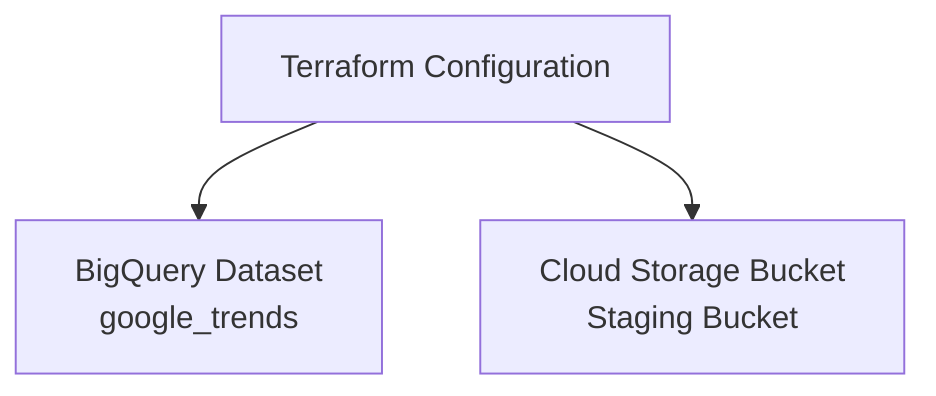

# GCP Data Warehouse Terraform Project

This project provisions core infrastructure for a simple data warehouse setup in Google Cloud using Terraform.

### ✅ What it Deploys
- A **BigQuery dataset** named `google_trends`
- A **Google Cloud Storage bucket** (with randomized suffix) for staging data

### 🌍 Deployment Context
- Region: `europe-west2` (London)
- Designed to run with `gcloud` Application Default Credentials

### 🚀 Getting Started

1. Authenticate with GCP:
   ```bash
   gcloud auth application-default login
   ```

2. Initialize Terraform:
   ```bash
   terraform init
   ```

3. Review the plan:
   ```bash
   terraform plan
   ```

4. Apply the deployment:
   ```bash
   terraform apply
   ```

5. View outputs:
   ```bash
   terraform output
   ```

### 🗃️ Notes
- The bucket is uniquely named using a random suffix to avoid naming conflicts.
- This project uses a simple dataset ID `google_trends` for demonstration purposes.
- You can modify variables in `terraform.tfvars`.

---

This infrastructure is a foundation for building GCP-based analytics workflows, and can be extended with IAM bindings, BigQuery tables, scheduled queries, and integration with Dataiku.

## Architecture Overview



## ⚙️ CI/CD Automation

This project includes a GitHub Actions workflow that performs the following on every pull request to `master`:

- Checks Terraform formatting (`terraform fmt`)
- Initializes the Terraform working directory (`terraform init`)
- Validates configuration syntax (`terraform validate`)
- Generates a plan to show what changes will be made (`terraform plan`)

It securely authenticates with GCP using a service account stored as a GitHub secret (`GCP_CREDENTIALS`), ensuring that infrastructure code is validated continuously without exposing sensitive credentials.